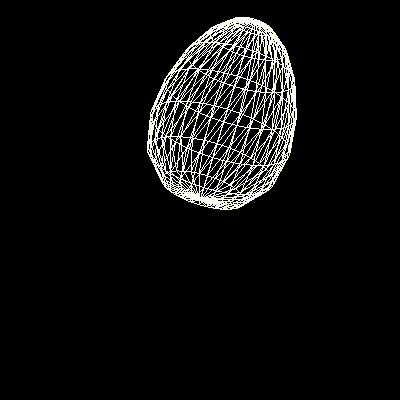

# 3D egg model in OpenGL

Visualization of a 3D egg model described by parametric equations. Written in c++ using OpenGL and GLUT libraries.


## Generate a native build system:


### Release mode:

```sh
cd release
cmake -DCMAKE_BUILD_TYPE=Release ..
```

### Debug mode:

```sh
cd debug
cmake -DCMAKE_BUILD_TYPE=Debug ..
```
## Compile/link the project:

In `release` or `debug` directory:


```sh
cmake --build .
```

## Run:

In `release` or `debug` directory:

```sh
./main -n <number_of_vertices>
```

- where `number_of_vertices` is the number of vertices in the width and height of the initial mesh (before applying the parametric transformations).

You can switch between different model display modes by pressing the keys:

- 'p' - vertices mode
- 'w' - mesh mode
- 's' - filled mesh mode with random colors



